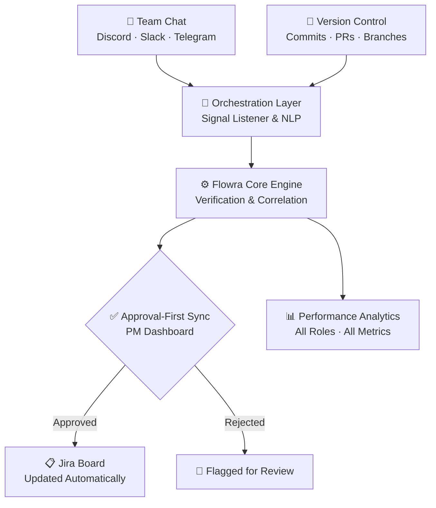

<div align="center">

# 🌊 Flowra

### Your Jira board is lying to you. Flowra tells the truth.

**An AI-driven Agile orchestration platform that listens to your team, reads your commits, and keeps your board honest — with a human always in the loop.**

[](https://flowra.m-faizananwar.com)
[](LICENSE)
[](https://turbo.build)


[**🚀 Live Demo**](https://flowra.m-faizananwar.com) · [**📖 The Problem**](#-the-problem) · [**🏗️ Architecture**](#️-how-it-works) · [**⚡ Quick Start**](#-quick-start) · [**🙌 Contributors**](#-the-humans-behind-flowra)

</div>

---

## 🧐 The Problem

In nearly every software team, the Jira board is a **lagging, inaccurate work of fiction**. Developers ship code, chat about it, and then — _sometimes, on a good day, if the moon is right_ — update the board manually.

That gap creates three very real headaches:

- **🗣️ Human reporting failure** — people just don't update tickets consistently.
- **🕵️ Verification gap** — a matching branch name is *not* proof the work is actually done.
- **👻 Invisible contributions** — QA, PMs, and marketing do real work that generates zero Git activity, so every Git-centric analytics tool pretends they don't exist.

## ✨ The Solution

Flowra sits between your **conversations**, your **code**, and your **board** — then proposes verified updates you actually approve before anything moves.

> Flowra listens to Discord/Slack/Telegram, cross-references it with GitHub activity, verifies the work was genuinely done, and proposes Jira updates through an **approval-first** workflow — while tracking performance across **every** role, not just developers.

## 🏗️ How It Works



## 🧩 What's Inside

```
flowra/
├── apps/
│   ├── web/            # Next.js 16 frontend + PM dashboard  (:3000)
│   └── engine/         # Express 5 connectivity engine       (:3005)
├── packages/
│   ├── types/          # Shared TypeScript definitions
│   ├── config-eslint/  # Shared ESLint config
│   └── config-typescript/  # Shared tsconfig bases
├── supabase/           # Database migrations
├── turbo.json          # Turborepo pipeline
└── pnpm-workspace.yaml
```

## 🛠️ Tech Stack

| Layer | Technology |
|---|---|
| **Frontend** | Next.js 16 · React 19 · TypeScript · TailwindCSS |
| **Backend** | Node.js · Express 5 · TypeScript |
| **Database** | Supabase (PostgreSQL) |
| **AI** | Google Gemini · Groq |
| **Integrations** | GitHub App · Jira OAuth · Slack Bolt · Discord.js · Telegram |
| **Infra** | Turborepo · pnpm workspaces · Docker · Vercel · VPS (CI/CD) |

## ⚡ Quick Start

> **Prerequisites:** Node.js `>= 20` and pnpm `>= 10` (`npm install -g pnpm`)

```bash
# 1. Clone & install
git clone https://github.com/m-faizananwar/flowra.git
cd flowra
pnpm install

# 2. Fire up everything in parallel
pnpm dev
```

That's it — `web` is on **http://localhost:3000**, `engine` on **http://localhost:3005**.

<details>
<summary><b>🎛️ More commands</b></summary>

```bash
# Run a single app
pnpm --filter @flowra/web dev
pnpm --filter @flowra/engine dev

# Build / lint / test the whole monorepo
pnpm build
pnpm lint
pnpm test
```

</details>

<details>
<summary><b>🔑 Environment variables</b></summary>

Each app reads its own `.env` file (never commit these):

- `apps/web/.env` — Next.js frontend config
- `apps/engine/.env` — engine config: Supabase, Gemini/Groq keys, and the GitHub / Jira / Slack / Discord / Telegram integration credentials.

</details>

<details>
<summary><b>🐳 Deployment</b></summary>

- **Frontend** → Vercel, auto-deployed on every push to `production`.
- **Engine** → Dockerized and deployed to a VPS via GitHub Actions on every push to `production` (build → restart → prune). See [`.github/workflows/ci.yml`](.github/workflows/ci.yml).

All infrastructure credentials live in **GitHub Secrets** — nothing sensitive is committed to this repo.

</details>

## 🙌 The Humans Behind Flowra

Flowra exists because these people poured real hours into it. Thank you. 💜

<div align="center">

| [<br /><sub><b>Muhammad Faizan Anwar</b></sub>](https://github.com/m-faizananwar)<br/>🚀 Project Lead | [<br /><sub><b>Muhammad Waleed</b></sub>](https://github.com/Muhammad-Waleed381)<br/>💻 Core Dev | [<br /><sub><b>Furqan Ahmad Basra</b></sub>](https://github.com/furqanahmadbasra)<br/>💻 Core Dev | [<br /><sub><b>Zarsham Waleed</b></sub>](https://github.com/zarshamwaleed)<br/>💻 Contributor |
| :---: | :---: | :---: | :---: |

</div>

_Built as **Group 3, Section C** — turning a Software Engineering course project into something that actually runs in production._

## 📜 License

Released under the [MIT License](LICENSE) — use it, fork it, ship it. Just keep the notice.

---

<div align="center">

**[🌊 flowra.m-faizananwar.com](https://flowra.m-faizananwar.com)** · Made with caffeine and a deep distrust of stale Jira boards.

</div>
