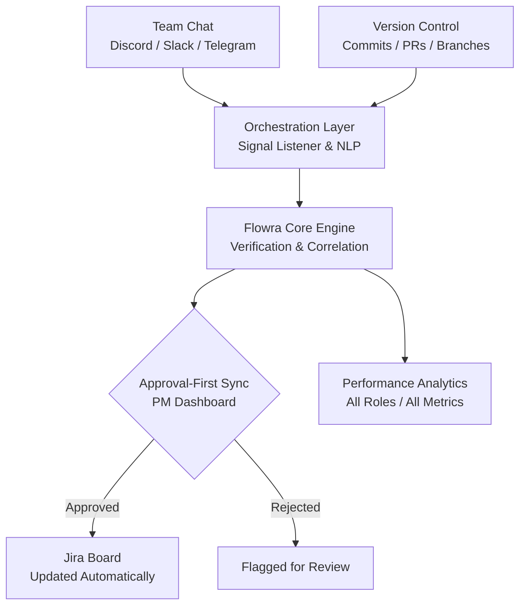

<div align="center">

# Flowra

### AI-driven Agile orchestration that keeps your Jira board honest.

Flowra listens to your team's conversations, cross-references them with real GitHub activity, verifies that work was genuinely completed, and proposes Jira updates through a human-approval workflow — while measuring performance across every role, not just developers.

[](https://flowra.m-faizananwar.com)
[](LICENSE)
[](https://turbo.build)


[Live Demo](https://flowra.m-faizananwar.com) · [The Problem](#the-problem) · [Architecture](#how-it-works) · [Quick Start](#quick-start) · [Contributors](#acknowledgements)

</div>

---

## The Problem

In most software teams, the Jira board is a lagging and inaccurate representation of reality. Developers ship code and discuss progress in chat, but the board is updated manually — inconsistently, and often not at all. This creates three distinct gaps:

- **Human reporting failure.** Tickets are not updated reliably, so the board drifts from what has actually been done.
- **Verification gap.** Existing automation reacts to branch names and commits, but a matching branch name is not proof that the work in a ticket was completed.
- **Invisible contributions.** Git-centric analytics ignore QA engineers, project managers, and other roles who produce real, measurable work that generates no GitHub activity.

## The Solution

Flowra sits between your conversations, your code, and your board. It correlates signals across all three, verifies completion, and proposes board updates that a human approves before anything changes — while tracking performance for every role on the team.

## How It Works



## Repository Structure

```
flowra/
├── apps/
│   ├── web/            # Next.js 16 frontend + PM dashboard  (:3000)
│   └── engine/         # Express 5 connectivity engine       (:3005)
├── packages/
│   ├── types/          # Shared TypeScript definitions
│   ├── config-eslint/  # Shared ESLint config
│   └── config-typescript/  # Shared tsconfig bases
├── supabase/           # Database migrations
├── turbo.json          # Turborepo pipeline
└── pnpm-workspace.yaml
```

## Tech Stack

| Layer | Technology |
|---|---|
| Frontend | Next.js 16 · React 19 · TypeScript · TailwindCSS |
| Backend | Node.js · Express 5 · TypeScript |
| Database | Supabase (PostgreSQL) |
| AI | Google Gemini · Groq |
| Integrations | GitHub App · Jira OAuth · Slack Bolt · Discord.js · Telegram |
| Infrastructure | Turborepo · pnpm workspaces · Docker · Vercel · VPS (CI/CD) |

## Quick Start

> **Prerequisites:** Node.js `>= 20` and pnpm `>= 10` (`npm install -g pnpm`)

```bash
# 1. Clone and install
git clone https://github.com/m-faizananwar/flowra.git
cd flowra
pnpm install

# 2. Start every app in parallel
pnpm dev
```

The web app runs on **http://localhost:3000** and the engine on **http://localhost:3005**.

<details>
<summary><b>Additional commands</b></summary>

```bash
# Run a single app
pnpm --filter @flowra/web dev
pnpm --filter @flowra/engine dev

# Build, lint, and test the whole monorepo
pnpm build
pnpm lint
pnpm test
```

</details>

<details>
<summary><b>Environment variables</b></summary>

Each app reads its own `.env` file, which must never be committed:

- `apps/web/.env` — Next.js frontend configuration.
- `apps/engine/.env` — engine configuration: Supabase, Gemini/Groq keys, and the GitHub, Jira, Slack, Discord, and Telegram integration credentials.

</details>

<details>
<summary><b>Deployment</b></summary>

- **Frontend** is deployed to Vercel on every push to `production`.
- **Engine** is containerized and deployed to a VPS through GitHub Actions on every push to `production` (build, restart, prune). See [`.github/workflows/ci.yml`](.github/workflows/ci.yml).

All infrastructure credentials are stored as GitHub Secrets; nothing sensitive is committed to this repository.

</details>

## Acknowledgements

Flowra is the product of a dedicated team whose time, care, and craftsmanship made it what it is. We are sincerely grateful for the effort each contributor invested in bringing this platform to life.

<div align="center">

| [<br /><sub><b>Muhammad Faizan Anwar</b></sub>](https://github.com/m-faizananwar)<br/><sub>Project Lead</sub> | [<br /><sub><b>Muhammad Waleed</b></sub>](https://github.com/Muhammad-Waleed381)<br/><sub>Core Developer</sub> | [<br /><sub><b>Furqan Ahmad Basra</b></sub>](https://github.com/furqanahmadbasra)<br/><sub>Core Developer</sub> | [<br /><sub><b>Zarsham Waleed</b></sub>](https://github.com/zarshamwaleed)<br/><sub>Contributor</sub> |
| :---: | :---: | :---: | :---: |

</div>

Our thanks also go to everyone who offered feedback, testing, and encouragement along the way. Flowra was developed by Group 3, Section C, as a Software Engineering course project — and carried through to a platform that runs in production.

## License

Released under the [MIT License](LICENSE).

---

<div align="center">

**[flowra.m-faizananwar.com](https://flowra.m-faizananwar.com)**

</div>
