---
tags:
  - srs
  - flowra
  - phase1
  - software-engineering
  - group3
created: 2026-04-21
status: draft
version: 1.0
---

# Flowra — Software Requirements Specification (SRS)

> [!INFO] Document Info
> **Project:** Flowra — Agentic Agile Orchestration & Performance Verification
> **Team:** Group 3, Section C
> **Version:** 1.0 — Phase 1 Draft
> **Date:** April 21, 2026
> **Project Lead:** Muhammad Faizan Anwar

---

## Table of Contents

1. [[#1. Introduction]]
2. [[#2. System Scope & Problem Statement]]
3. [[#3. Stakeholder Analysis]]
4. [[#4. Requirement Gathering Summary]]
5. [[#5. Functional Requirements — User Stories]]
6. [[#6. Non-Functional Requirements]]
7. [[#7. System Architecture Overview]]
8. [[#8. UML Modeling]]
9. [[#9. MoSCoW Prioritization]]
10. [[#10. Technical Tools & Technologies]]
11. [[#11. Appendix]]

---

## 1. Introduction

### 1.1 Purpose

This Software Requirements Specification (SRS) document formally defines the functional and non-functional requirements for **Flowra**, an AI-driven Agile orchestration platform. It serves as the primary reference for design, development, and evaluation throughout the project lifecycle.

This document has been prepared as part of Phase 1 of the Software Engineering course project and is based on three methods of requirement gathering: a semi-structured stakeholder interview, a survey/questionnaire, and a comparative document analysis.

### 1.2 Intended Audience

| Audience | Purpose |
| :--- | :--- |
| Development Team | Implementation reference and feature scope |
| Project Manager | Sprint planning and backlog prioritization |
| Course Evaluators | Assessment of Phase 1 requirements gathering |
| QA Engineers | Test case derivation and acceptance criteria |
| Stakeholders | Validation of problem understanding and scope |

### 1.3 Definitions & Acronyms

| Term | Definition |
| :--- | :--- |
| **Flowra** | The AI orchestration platform being developed |
| **Orchestration Layer** | The agentic signal-listening component within the Flowra ecosystem |
| **Signal** | A meaningful developer communication event (e.g., "I finished the auth feature") |
| **Proof of Work** | Verified evidence in version control that a stated task was actually completed |
| **Approval-First Sync** | The workflow where Flowra suggests a Jira card move but waits for PM approval before executing it |
| **SRS** | Software Requirements Specification |
| **PM** | Project Manager |
| **NLP** | Natural Language Processing |
| **PR** | Pull Request |
| **MoSCoW** | Must Have, Should Have, Could Have, Won't Have — a prioritization framework |
| **CI/CD** | Continuous Integration / Continuous Deployment |

### 1.4 Scope Overview

Flowra is scoped to software development teams using Jira for project management, GitHub for version control, and one or more of Discord, Slack, or Telegram for team communication. The system automates the verification and synchronization of Jira boards by connecting these three layers into a single intelligent pipeline.

---

## 2. System Scope & Problem Statement

### 2.1 The Problem

> [!WARNING] Core Pain Point
> In nearly every software team, the Jira board is a **lagging, inaccurate representation** of reality. Developers communicate progress in chat, push code to GitHub, and then — sometimes — update the board manually. This disconnect creates overhead, reduces trust in the board, and forces project managers into a reactive monitoring role that consumes time better spent on product decisions.

The problem has three distinct layers:

**Layer 1 — Human Reporting Failure**
Developers do not consistently update Jira. The manual step creates a gap between what is actually done and what the board shows. No existing tool closes this gap through intelligent, multi-source verification.

**Layer 2 — Verification Gap**
Even where automation exists (e.g., Jira rules triggered by GitHub branch names), the system does not verify that work was actually completed. A branch name match is not proof of work. A commit is not proof that the requirements in the ticket were addressed.

**Layer 3 — Invisible Non-Developer Contributions**
Analytics tools like LinearB are entirely Git-centric. QA engineers, project managers, and marketing team members produce real, measurable work that generates zero GitHub activity. Their contributions are invisible to every existing tool.

### 2.2 The Solution

Flowra closes all three gaps through a three-layer architecture:

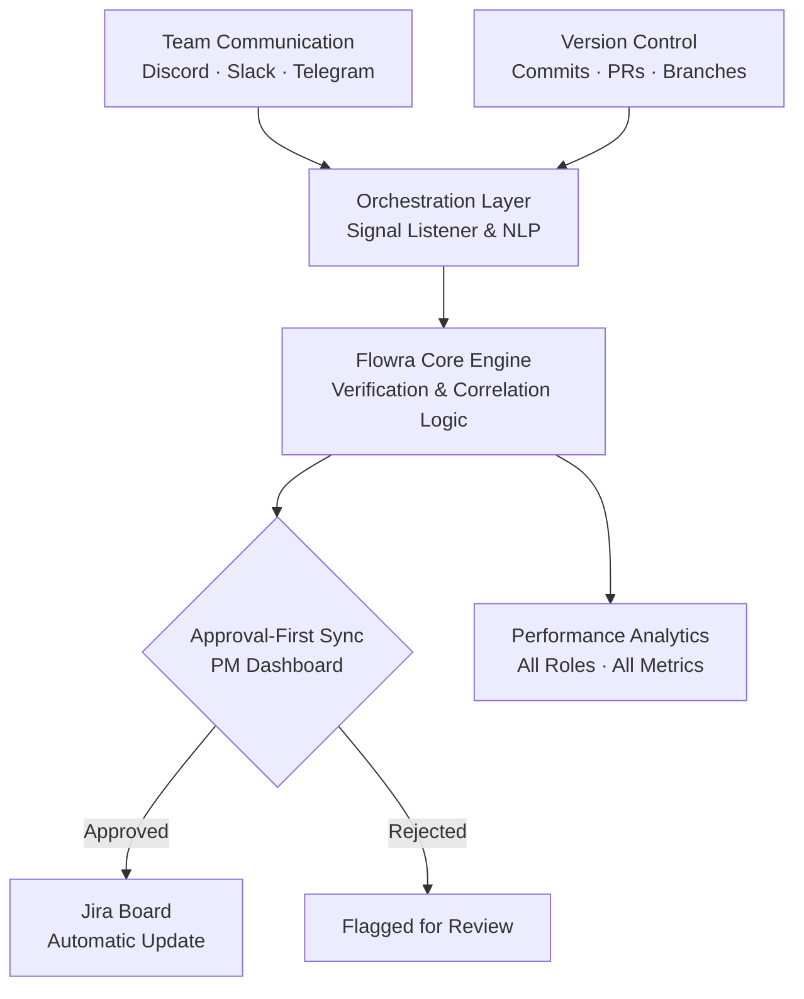

### 2.3 Problem Statement 

> *Software development teams using Jira for project management experience chronic inaccuracy in their project boards due to manual, inconsistent ticket updates. Existing automation tools rely on rigid naming conventions and provide no verification that work was actually completed. Additionally, performance visibility is limited to developers, leaving QA, marketing, and management contributions unmeasured. Flowra addresses these gaps by introducing an AI-driven orchestration layer that listens to team communication, cross-references it with GitHub activity, and proposes verified Jira updates through a human-approval workflow — while simultaneously tracking performance across all team roles.*

### 2.4 System Boundaries

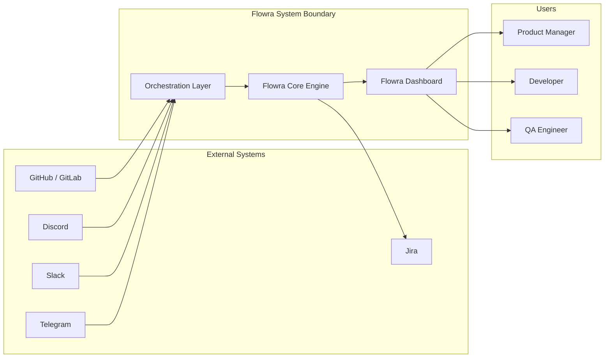

---

## 3. Stakeholder Analysis

### 3.1 Primary Stakeholders

#### 3.1.1 Product Manager / Project Lead

> [!NOTE] Stakeholder Profile — Product Manager
> **Role:** Oversees sprint execution, approves card movements, monitors team health
> **Primary Pain:** Spends significant time chasing ticket updates and manually checking progress
> **Goal:** Real-time, accurate project board with minimal operational overhead
> **Interaction with Flowra:** Receives suggested card movements, approves or rejects them, views the analytics dashboard

**Interests:**
- Accurate Jira board without manual intervention
- Sprint velocity and bottleneck visibility
- Fair, data-driven team performance metrics
- Human control retained over AI suggestions (Approval-First Sync)

**Concerns:**
- Loss of granular awareness if too much is automated
- Over-reliance on AI correctness before trust is established

---

#### 3.1.2 Developer

> [!NOTE] Stakeholder Profile — Developer
> **Role:** Writes code, opens PRs, communicates progress in team channels
> **Primary Pain:** Repetitive, context-switching overhead of manually updating Jira after every task
> **Goal:** Zero friction between doing work and having the board reflect it
> **Interaction with Flowra:** Work is passively monitored; receives notifications when Flowra detects and verifies completion

**Interests:**
- Minimal disruption to existing workflow
- Accurate credit for work done
- No false positives that create noise in the approval queue

**Concerns:**
- Privacy of communication channel monitoring
- Trust in AI accuracy before it becomes a performance metric input

---

#### 3.1.3 QA Engineer

> [!NOTE] Stakeholder Profile — QA Engineer
> **Role:** Writes test cases, files bug reports, verifies releases
> **Primary Pain:** Contributions are entirely invisible to Git-based analytics tools
> **Goal:** Performance visibility proportional to actual contribution
> **Interaction with Flowra:** Bug reports, test case tracking, and Jira activity are monitored and surfaced in analytics

**Interests:**
- Recognition for work that doesn't produce GitHub commits
- Automated tracking of bug-report-to-resolution cycles
- Visibility into sprint quality metrics

**Concerns:**
- Metrics being unfair or not representative of test complexity

---

### 3.2 Secondary Stakeholders

| Stakeholder | Role | Interest in Flowra |
| :--- | :--- | :--- |
| **System Administrator** | Manages infrastructure and integrations | Secure, maintainable configuration interface; stable VPS deployment |
| **Marketing / Content Team** | Manages campaign materials and documentation | Performance metrics tied to document activity and communication rather than Git |
| **Executive / Team Lead** | Reviews overall team health | High-level sprint summaries, velocity trends, team contribution scores |
| **Tanguy De Branbandre (External Stakeholder)** | LYTE Studios CEO, subject matter expert | Validated problem domain from industry experience; provided technical feedback on feasibility |

### 3.3 Stakeholder Interest vs. Influence Matrix

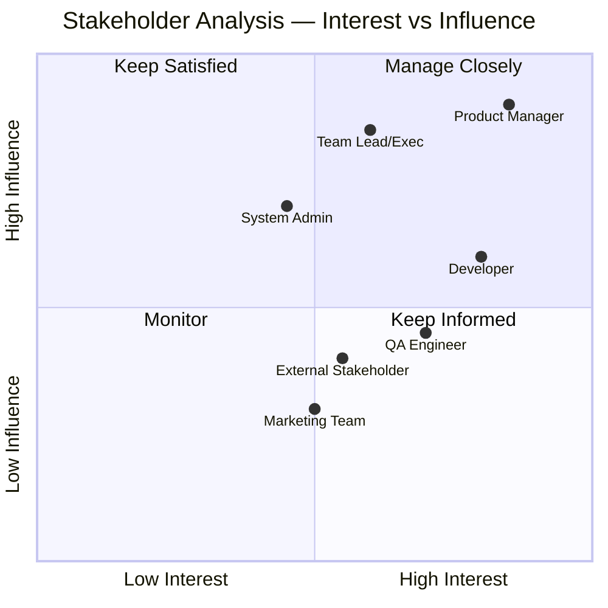

---

## 4. Requirement Gathering Summary

### 4.1 Method 1 — Semi-Structured Interview

> [!INFO] Interview Details
> **Date:** April 21, 2026
> **Stakeholder:** Tanguy De Branbandre, Founder & CEO, LYTE Studios
> **Duration:** ~36 minutes
> **Format:** Video Call (Recorded)
| Artifact | Link |
| :--- | :--- |
| **Interview Recording** | [View on Google Drive](https://drive.google.com/file/d/1ts_KpKQ1sSobvANIeXNcyr2BoMLHs4yj/view?usp=sharing) |
| **Interview Transcript** | [View on Google Drive](https://drive.google.com/file/d/1deOCLmS4A05eaIaed9GSmT6v-9jDIyf9/view?usp=sharing) |

**Key Findings:**

| Theme                  | Finding                                                                                                          |
| :--------------------- | :--------------------------------------------------------------------------------------------------------------- |
| Problem Validation     | Confirmed that manual tracking is a recognized industry pain point; human error in the loop is a primary concern |
| AI Hallucination Risk  | Noted that AI-assisted workflows introduce new failure modes; verification layer is critical                     |
| Risk Intelligence      | Stakeholder emphasized risk analysis as a high-value area for future expansion                                   |
| Approval-First Sync    | Validated: trust must be built incrementally before full automation is appropriate                               |
| Multi-Platform Support | Agreed that unifying multiple communication platforms under one layer is the right architectural decision        |
| Competitive Landscape  | OpenAI and Deepset operating in adjacent spaces; Flowra's edge is in cross-channel signal correlation            |

> [!QUOTE] Stakeholder Quote — Tanguy De Branbandre
> *"The risk analysis part I find genuinely innovative. The extraction of meaningful insight from project communication data combined with code activity, and using that to surface risk proactively — that's more interesting. That's the part that could actually matter."*

---

### 4.2 Method 2 — Survey / Questionnaire

> [!INFO] Survey Details
> **Platform:** Google Forms
> **Title:** *"Stop Updating Jira Manually" Survey (Flowra Discovery)*
> **Target Audience:** University students in software development group projects
> **Distribution:** Shared via academic networks
> **Link:** [View on Google Forms](https://forms.gle/qcPJZUgfk7o6YhMb9)

**Survey Structure:**
- **Section 1:** Demographics and current tooling baseline
- **Section 2:** Current workflow pain points and frustration levels
- **Section 3:** Feature validation (Flowra-specific concepts)
- **Section 4:** Open-ended wildcard responses

**Key Validated Insights:**

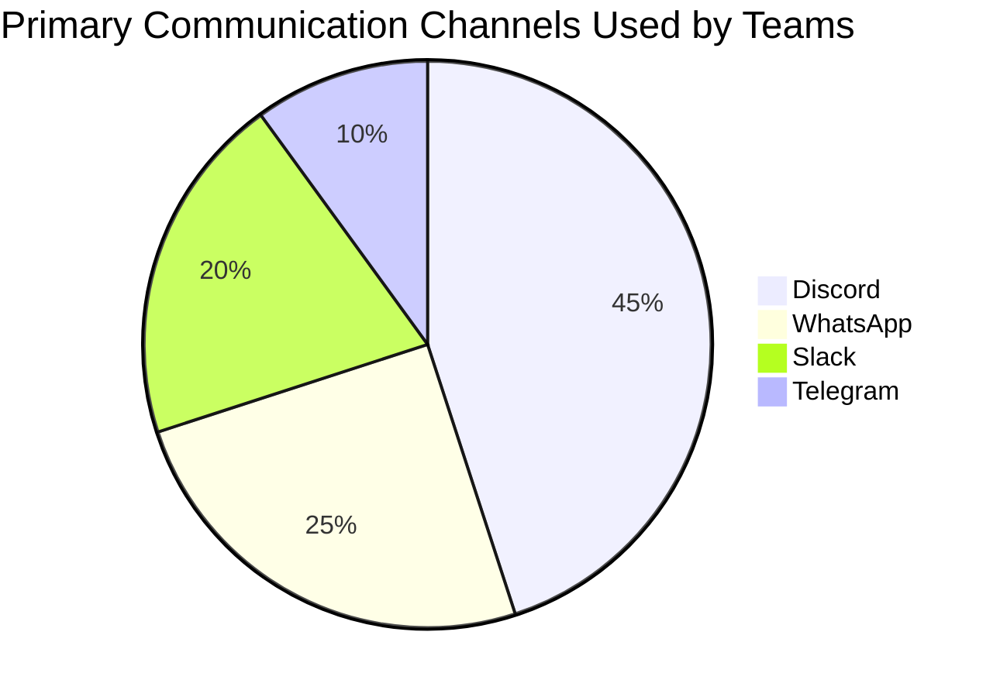

> [!TIP] Survey Insight 1 — Manual Update Frustration
> The majority of respondents reported **high frustration (4–5/5)** with the manual effort required to keep task boards synchronized with actual progress.

> [!TIP] Survey Insight 2 — Forgetting to Update Boards
> When asked how often they forget to move tasks to "Done," the most common responses were **"Constantly — the board is a web of lies"** and **"I wait for the PM to yell at me."**

> [!TIP] Survey Insight 3 — Approval-First Sync Demand
> When presented with the Approval-First Sync concept, the most selected response was **"Crucial — I don't trust AI to touch the board unsupervised."** This directly validates the approval gate as a must-have feature.

> [!TIP] Survey Insight 4 — Non-Developer Visibility
> Non-developer respondents (QA, Marketing, Design) reported their work as largely **invisible** in current tooling, with most selecting 1–2 out of 5 on the visibility scale.

> [!TIP] Survey Insight 5 — Efficiency Improvement Expectation
> Most respondents estimated **significant efficiency improvement (4–5/5)** if board updates were automated with human approval.

---

### 4.3 Method 3 — Comparative Document Analysis

> [!INFO] Analysis Details
> **Document:** `comparative_analysis.md`
> **Systems Analyzed:** Jira Software, LinearB, Zapier + GitHub + Slack Stack, Notion AI
> **Evaluation Criteria:** 9 feature dimensions directly relevant to Flowra's scope

**Findings Summary:**

```mermaid
xychart-beta
    title "Feature Coverage by System (0 = None, 1 = Partial, 2 = Full)"
    x-axis ["Auto Card Move", "Chat Listening", "Code Verification", "Approval Step", "Dev Analytics", "Non-Dev Analytics", "NLU", "Sprint Tracking", "Easy Setup"]
    y-axis 0 --> 2
    bar [1, 0, 0, 0, 1, 0, 0, 2, 1]
    bar [1, 0, 0, 0, 2, 0, 0, 2, 0]
    bar [1, 1, 0, 0, 0, 0, 0, 0, 1]
    bar [0, 0, 0, 0, 0, 0, 1, 0, 2]
```

> [!NOTE] Legend: Blue = Jira, Orange = LinearB, Green = Zapier, Purple = Notion AI

**Critical Gaps Identified:**

1. **No tool reads team conversation** — Jira, LinearB, and Zapier all require structured Git events; natural language in chat is ignored entirely
2. **No tool verifies work before moving a card** — automation is rule-based, not evidence-based
3. **No tool includes a human approval step** — changes are either automatic or don't exist
4. **No tool tracks non-developer contributions** — LinearB is the best analytics tool but is entirely Git-centric
5. **Multi-platform support is fragmented** — Unified context across Discord, Slack, and Telegram is absent in current tools

**Conclusion:** Flowra addresses a real, documented gap that no single existing tool fills.

---

## 5. Functional Requirements — User Stories

> [!NOTE] Format
> Each user story follows the format:
> **As a** [role], **I want to** [capability] **so that** [business value].
> Acceptance criteria are defined per story.

---

### 5.1 Role: Product Manager

---

#### US-PM-01 — Dashboard Overview

**Priority:** `Must Have`

> As a **Product Manager**, I want to see a real-time dashboard of my team's sprint progress — including pending Flowra suggestions, sprint velocity, and active blockers — so that I can make informed decisions without manually checking Jira, Slack, and GitHub separately.

**Acceptance Criteria:**
- [ ] Dashboard loads within 3 seconds of login
- [ ] Sprint progress is shown as a percentage of completed vs. total story points
- [ ] Pending approval cards are displayed in a dedicated queue
- [ ] Active blockers are highlighted with source context (which channel, which conversation)
- [ ] Dashboard auto-refreshes every 60 seconds

---

#### US-PM-02 — Approve or Reject Card Movements (Approval-First Sync)

**Priority:** `Must Have`

> As a **Product Manager**, I want to review AI-suggested Jira card transitions before they are applied, so that I remain in control of the board state and can catch any inaccuracies before they create confusion.

**Acceptance Criteria:**
- [ ] Each suggestion shows: the Jira ticket, suggested transition, source channel message, and supporting GitHub evidence
- [ ] PM can approve with a single click, which triggers the Jira API update
- [ ] PM can reject with an optional reason field
- [ ] Rejected suggestions are logged and do not re-surface unless new evidence is detected
- [ ] Flowra never updates Jira automatically without an approval action

---

#### US-PM-03 — Team Performance Analytics

**Priority:** `Should Have`

> As a **Product Manager**, I want to see performance metrics for every team member — including developers, QA, and marketing — so that sprint retrospectives are based on objective data, not subjective impressions.

**Acceptance Criteria:**
- [ ] Developer metrics include: commit frequency, PR open/merge times, code review participation
- [ ] QA metrics include: bug reports filed, test coverage contributions, verification turnaround time
- [ ] Non-developer metrics include: communication frequency, document updates, task mentions in chat
- [ ] Metrics are displayed per individual and per sprint
- [ ] Data can be exported as a summary report

---

#### US-PM-04 — Sprint Velocity and Bottleneck Detection

**Priority:** `Should Have`

> As a **Product Manager**, I want to see sprint velocity trends and automatic detection of workflow bottlenecks, so that I can proactively address slowdowns before they impact delivery.

**Acceptance Criteria:**
- [ ] Velocity chart shows story points completed per sprint over the last 5 sprints
- [ ] Bottlenecks are flagged when a card has been in the same state for more than a configurable threshold (default: 3 days)
- [ ] Bottleneck alerts include the responsible team member and last known activity

---

#### US-PM-05 — Integration Configuration

**Priority:** `Must Have`

> As a **Project Manager / System Admin**, I want to connect my team's GitHub repository, Jira board, and communication channels through a guided setup interface, so that Flowra has access to all relevant data sources without requiring manual API configuration.

**Acceptance Criteria:**
- [ ] OAuth-based connection for GitHub (organization-level access)
- [ ] Jira API key configuration with connection test feedback
- [ ] Discord/Slack/Telegram bot setup with step-by-step instructions
- [ ] System shows a "connected" / "disconnected" status for each integration
- [ ] Configuration changes take effect within 60 seconds without requiring a restart

---

### 5.2 Role: Developer

---

#### US-DEV-01 — Zero-Friction Task Completion Signal

**Priority:** `Must Have`

> As a **Developer**, I want my mentions of completed work in Slack/Discord (e.g., "pushed the auth fix") to be automatically recognized as a completion signal by Flowra, so that I never have to manually open Jira to move a card.

**Acceptance Criteria:**
- [ ] Flowra detects at least 85% of common "done" signal phrases in English
- [ ] Signal extraction does not require any specific phrasing format or keyword conventions
- [ ] When a signal is detected, the related Jira ticket is identified automatically based on context
- [ ] The developer receives no notification unless Flowra needs clarification

---

#### US-DEV-02 — Proof of Work Verification

**Priority:** `Must Have`

> As a **Developer**, I want Flowra to verify my completion claims against my actual GitHub commits and PRs before surfacing a Jira suggestion, so that the system only suggests card moves when the work is demonstrably done.

**Acceptance Criteria:**
- [ ] Flowra queries the linked GitHub repository for commits and PRs matching the task context
- [ ] Verification checks: commit recency, branch association, PR state (open/merged/closed)
- [ ] If no supporting GitHub activity is found, no card move is suggested
- [ ] Developer can view what evidence Flowra used for any given suggestion via the dashboard

---

#### US-DEV-03 — Performance Metrics Visibility

**Priority:** `Could Have`

> As a **Developer**, I want to view my own contribution metrics (PR frequency, code review participation, commit quality) on my personal Flowra profile, so that I can track my performance and compare it with sprint expectations.

**Acceptance Criteria:**
- [ ] Personal metrics page is accessible after login
- [ ] Metrics shown for current sprint and the last 3 sprints
- [ ] Commit quality score is based on message completeness (not just "fix" or "update")
- [ ] PR cycle time (open → merge) is displayed

---

#### US-DEV-04 — Notification for Suggestion Status

**Priority:** `Should Have`

> As a **Developer**, I want to receive a notification when the PM approves or rejects a Flowra suggestion tied to my work, so that I know when my Jira ticket has been updated without having to check the board.

**Acceptance Criteria:**
- [ ] Notification is delivered to the same channel where the original signal was detected
- [ ] Notification shows: ticket name, new status, and who approved it
- [ ] Notifications can be disabled per user in settings

---

#### US-DEV-05 — PR and Commit Linking

**Priority:** `Must Have`

> As a **Developer**, I want Flowra to automatically link my pull requests and commits to the corresponding Jira tickets based on content and context, so that the relationship between code and tickets is always clear without manual cross-referencing.

**Acceptance Criteria:**
- [ ] PR linking works even when the branch does not follow a specific naming convention
- [ ] Context matching uses both ticket title and PR/commit content
- [ ] Multiple commits can be linked to a single Jira task
- [ ] Link accuracy is logged for system improvement

---

### 5.3 Role: QA Tester

---

#### US-QA-01 — Bug Report Tracking

**Priority:** `Must Have`

> As a **QA Tester**, I want my bug reports filed in Jira to be automatically tracked and linked to the relevant sprint and feature, so that my contributions are visible and measurable without requiring additional manual reporting.

**Acceptance Criteria:**
- [ ] All bug reports created by the QA tester are captured in analytics automatically
- [ ] Each bug report shows time-to-assignment, time-to-fix, and assignee
- [ ] Bug counts are included in QA's performance metrics

---

#### US-QA-02 — Test Coverage Visibility

**Priority:** `Should Have`

> As a **QA Tester**, I want Flowra to track test case creation and execution against sprint tickets, so that the test coverage for each release is visible to the team without manual reporting.

**Acceptance Criteria:**
- [ ] Test cases linked to Jira tickets are monitored for status changes
- [ ] Coverage percentage (tickets with at least one verified test case) is displayed per sprint
- [ ] QA tester can mark manual test results directly in the Flowra dashboard

---

#### US-QA-03 — Regression Risk Flagging

**Priority:** `Could Have`

> As a **QA Tester**, I want Flowra to flag commits that touch high-risk areas of the codebase (previously buggy files, frequently changed modules) as potential regression risks, so that I can prioritize those areas in my test cycle.

**Acceptance Criteria:**
- [ ] Flowra identifies files with the highest historical bug density from Jira bug reports and commit history
- [ ] Any PR touching flagged files triggers a regression risk alert visible to QA
- [ ] Alert severity is rated (Low / Medium / High) based on historical data

---

#### US-QA-04 — Chat-Based Test Sign-Off

**Priority:** `Should Have`

> As a **QA Tester**, I want my "testing complete" or "verified" messages in team chat to trigger a Jira card transition suggestion (e.g., *In Review* → *Done*), so that sign-offs in chat are reflected on the board automatically.

**Acceptance Criteria:**
- [ ] QA sign-off phrases are recognized in English across Discord, Slack, and Telegram
- [ ] Only QA role accounts can trigger sign-off transitions
- [ ] Sign-off triggers the PM approval queue the same way developer signals do

---

#### US-QA-05 — Sprint Quality Report

**Priority:** `Could Have`

> As a **QA Tester**, I want a per-sprint quality summary showing bugs found, bugs resolved, test pass rate, and regressions introduced, so that retrospectives include data from the QA perspective.

**Acceptance Criteria:**
- [ ] Quality report is auto-generated at sprint close
- [ ] Report is accessible in the Flowra dashboard and exportable as PDF
- [ ] Data is sourced from Jira bug reports and Flowra's QA activity tracking

---

## 6. Non-Functional Requirements

### 6.1 Performance

> [!WARNING] Performance Constraints

| Requirement | Target |
| :--- | :--- |
| Signal detection latency | < 30 seconds from message to suggestion creation |
| Dashboard load time | < 3 seconds on a standard broadband connection |
| Jira sync execution time (post-approval) | < 5 seconds |
| GitHub query response time | < 10 seconds per verification request |
| System uptime | ≥ 99% during active sprint hours (06:00–24:00 local time) |
| Concurrent user support | Minimum 50 concurrent users per project instance |

### 6.2 Security

> [!DANGER] Security Requirements

| Requirement | Specification |
| :--- | :--- |
| Authentication | OAuth 2.0 for all third-party integrations (GitHub, Jira, Slack) |
| Data in transit | TLS 1.3 for all API communications |
| Data at rest | AES-256 encryption for stored credentials and chat logs |
| API keys | Never stored in plaintext; encrypted using project-level key management |
| Access control | Role-based access control (RBAC): PM, Developer, QA, Admin |
| Session management | JWT tokens with 24-hour expiry and refresh token rotation |
| Audit logging | All approval actions and Jira updates are logged with timestamp and actor |
| Chat data | Only metadata and relevant signal context is retained; full message logs are not stored permanently |

### 6.3 Usability

| Requirement | Specification |
| :--- | :--- |
| Onboarding | New team setup (integrations configured) completable in under 15 minutes |
| Approval UX | A PM should be able to review and approve/reject a suggestion in under 10 seconds |
| Mobile responsiveness | Dashboard must be usable on tablet-sized screens (768px and above) |
| Error messages | All error states must display actionable guidance, not raw error codes |
| Accessibility | Minimum WCAG 2.1 AA compliance for the web dashboard |

### 6.4 Scalability

| Requirement | Specification |
| :--- | :--- |
| Project instances | System must support multiple independent project instances |
| Channel volume | Must handle teams with up to 500 messages per day across all monitored channels |
| Repository size | Must function on repositories with up to 10,000 commits in history |
| Horizontal scaling | Core engine must support horizontal scaling across cloud infrastructure |

### 6.5 Reliability & Maintainability

| Requirement | Specification |
| :--- | :--- |
| Failure recovery | System must auto-retry failed Jira sync operations up to 3 times before alerting the PM |
| Data consistency | No Jira update may occur without a confirmed approval record in the database |
| Logging | All signal detections, verifications, and Jira actions are logged with full context |
| Configuration | Integration credentials must be re-configurable without restarting the system |

---

## 7. System Architecture Overview

### 7.1 Component Overview

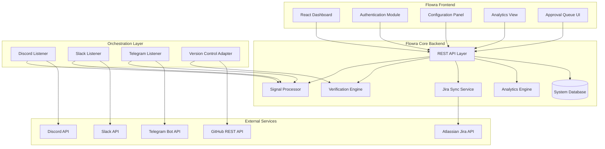

### 7.2 Data Flow — Core Workflow

The core Flowra workflow from signal to board update:

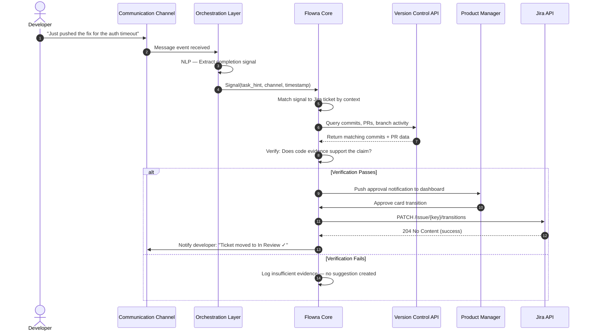

---

## 8. UML Modeling

### 8.1 Use Case Diagram

```mermaid
flowchart TB
    PM(["👤 Product Manager"])
    DEV(["👤 Developer"])
    QA(["👤 QA Tester"])
    ADM(["👤 System Admin"])
    SYS(["⚙️ Flowra System\n(Automated Actor)"])

    subgraph Flowra System
        UC1([View Dashboard])
        UC2([Approve Card Movement])
        UC3([Reject Card Movement])
        UC4([View Team Analytics])
        UC5([Configure Integrations])
        UC6([View Sprint Velocity])
        UC7([Detect Completion Signal])
        UC8([Verify Proof of Work])
        UC9([Suggest Jira Transition])
        UC10([View Personal Metrics])
        UC11([Track Bug Reports])
        UC12([File QA Sign-Off])
        UC13([Generate Sprint Report])
        UC14([Manage User Access])
    end

    PM --> UC1
    PM --> UC2
    PM --> UC3
    PM --> UC4
    PM --> UC5
    PM --> UC6

    DEV --> UC10

    QA --> UC11
    QA --> UC12

    ADM --> UC14
    ADM --> UC5

    SYS --> UC7
    SYS --> UC8
    SYS --> UC9
    SYS --> UC13
```

### 8.2 Sequence Diagram — Approval-First Sync (Full Detail)

*(See Section 7.2 above for the primary sequence. The diagram below shows the rejection path.)*

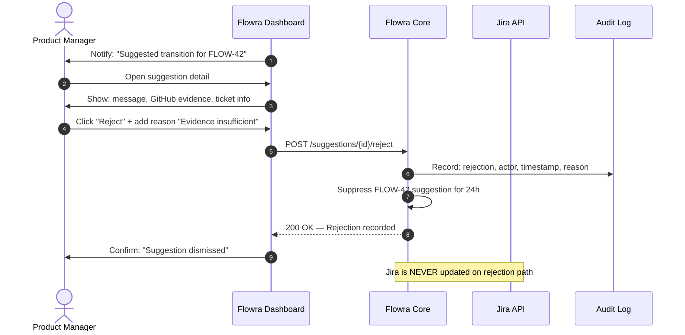

### 8.3 Class Diagram

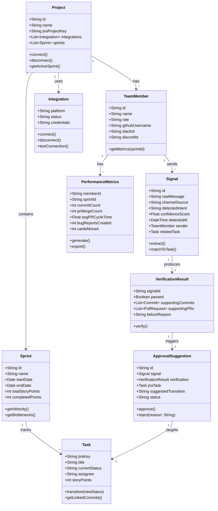

### 8.4 System Context Diagram

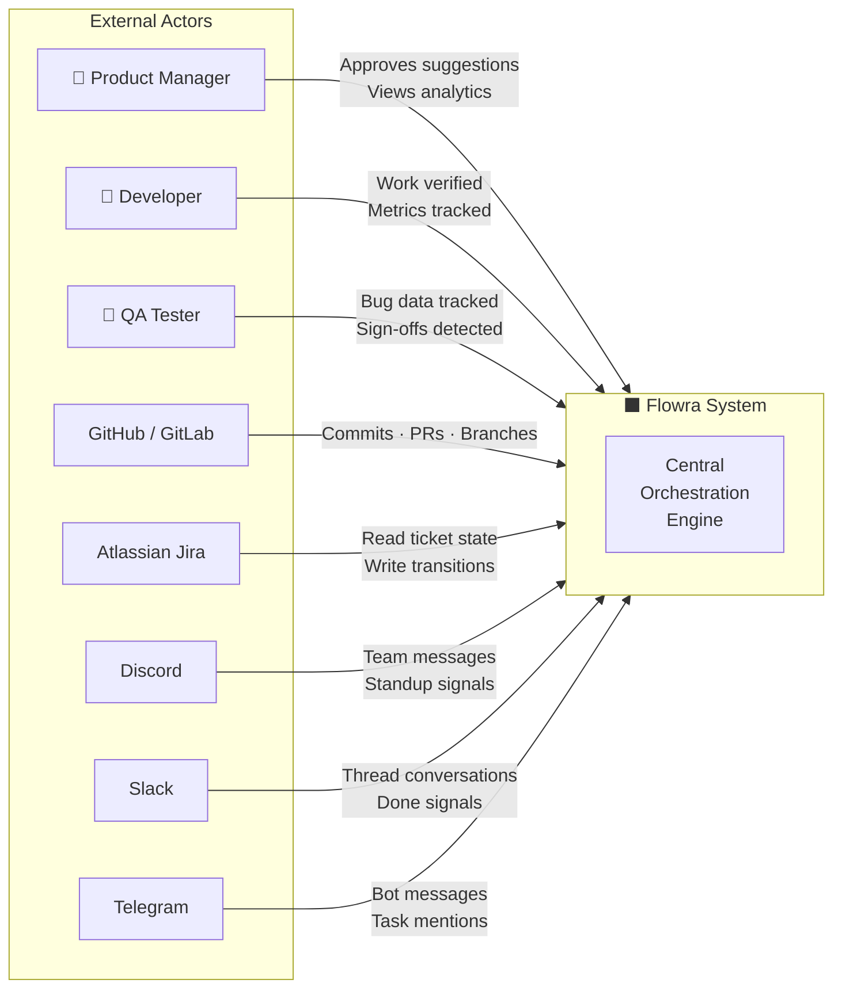

---

## 9. MoSCoW Prioritization

> [!INFO] MoSCoW Framework
> Requirements are prioritized across four categories:
> - **Must Have** — Core functionality; product fails without this
> - **Should Have** — High-value features for the initial release
> - **Could Have** — Valuable but not critical for MVP
> - **Won't Have** — Explicitly out of scope for Phase 1 / MVP

### 9.1 Feature Prioritization Table

| Feature | Role | Priority | Rationale |
| :--- | :--- | :---: | :--- |
| Approval-First Sync dashboard | PM | `Must Have` | Core differentiator; validated by interview and survey |
| Jira card transition via API | PM | `Must Have` | Primary output of the system |
| Discord/Slack signal listening | System | `Must Have` | Primary input source |
| GitHub commit/PR verification | System | `Must Have` | Defines Flowra as a verifier, not just an automator |
| Integration configuration panel | Admin/PM | `Must Have` | Required before any other feature functions |
| Developer performance metrics | PM/DEV | `Should Have` | High demand from survey; validates developer contribution |
| QA bug tracking + sign-off | QA | `Must Have` | Required for 3-role coverage per phase specification |
| Non-developer analytics (Marketing, QA) | PM | `Should Have` | Survey confirmed this is a pain point |
| Sprint velocity and bottleneck alerts | PM | `Should Have` | Important for sprint planning value |
| Telegram integration | System | `Should Have` | Survey showed it as a used platform |
| Regression risk flagging | QA | `Could Have` | Innovative but complex; depends on historical data |
| Personal metrics page for developers | DEV | `Could Have` | Useful UX but not blocking MVP |
| Sprint quality report (auto-generated) | QA | `Could Have` | Good for retrospectives; not launch-blocking |
| AI-generated sprint summaries | PM | `Could Have` | Enhances value post-MVP |
| Modular plug-in marketplace | All | `Won't Have` | Future direction proposed in stakeholder interview; out of Phase 1 scope |
| Physical environment integrations | All | `Won't Have` | Explicitly out of scope (construction sites, non-digital workflows) |
| Security audit module (Kido-level) | System | `Won't Have` | Aspirational; requires dedicated R&D beyond Phase 1 |
| Full multi-tenant SaaS infrastructure | All | `Won't Have` | Post-launch consideration |

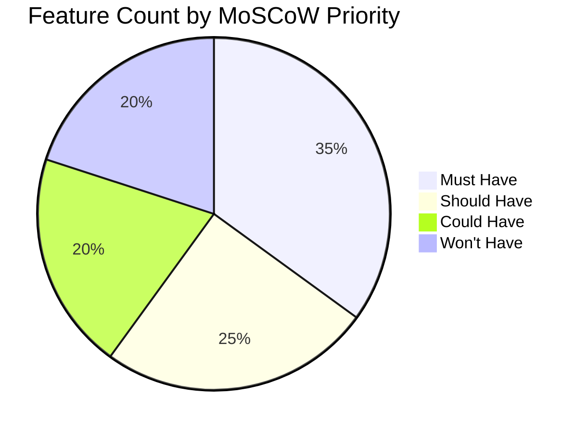

---

## 10. Technical Tools & Technologies

As required for Phase 1 documentation, the following tools were utilized for requirement gathering, analysis, and system design:

| Category | Tool Used | Purpose |
| :--- | :--- | :--- |
| **Project Management** | **Jira Software** | User story management, backlog prioritization, and sprint planning |
| **Version Control** | **GitHub** | Repository hosting and "Proof of Work" verification source |
| **Requirement Gathering** | **Google Forms** | Distribution of the "Flowra Discovery" questionnaire |
| **Stakeholder Interview** | **Zoom / OBS** | Recording and capturing the interview with Tanguy De Branbandre |
| **Documentation** | **Obsidian** | SRS drafting, Markdown management, and document linking |
| **UML Modeling** | **Mermaid.js** | Creation of Use Case, Sequence, Class, and Context diagrams |
| **Communication** | **Discord / Slack** | Primary team communication and signal source testing |
| **Technical Research** | **Claude / Antigravity** | Comparative analysis research and document polishing |

---

## 11. Appendix

### 11.1 Meeting & Activity Log

| Date               | Activity                | Participants   | Outcomes                                                                |
| :----------------- | :---------------------- | :------------- | :---------------------------------------------------------------------- |
| **April 15, 2026** | Initial Project Kickoff | Full Team      | Defined core vision, drafted README, and assigned roles                 |
| **April 17, 2026** | Research Sync           | Faizan, Waleed | Initiated Comparative Analysis and identified target competitors        |
| **April 19, 2026** | Survey Launch           | Anas, Waleed   | Finalized Google Form questions and distributed to target audience      |
| **April 20, 2026** | Interview Prep          | Faizan, Furqan | Prepared interview script and technical questions for stakeholder       |
| **April 21, 2026** | Stakeholder Interview   | Faizan, Tanguy | Validated problem statement and identified risk analysis as a key pivot |
| **April 21, 2026** | SRS Finalization        | Full Team      | Compiled all gathering methods into the formal SRS document             |

### 11.2 Evidence Index

| Artifact | Location / Link | Description |
| :--- | :--- | :--- |
| **Interview Recording** | [View Recording (Google Drive)](https://drive.google.com/file/d/1ts_KpKQ1sSobvANIeXNcyr2BoMLHs4yj/view?usp=sharing) | 36-minute video call with Tanguy De Branbandre |
| **Interview Transcript** | [View Transcript (Google Drive)](https://drive.google.com/file/d/1deOCLmS4A05eaIaed9GSmT6v-9jDIyf9/view?usp=sharing) | Reconstructed, professional transcript of the session |
| **Questionnaire (Survey)** | [View Form (Google Forms)](https://forms.gle/qcPJZUgfk7o6YhMb9) | "Stop Updating Jira Manually" discovery survey |
| **Survey Results** | `form.md` | Raw response data and question set |
| **Comparative Analysis** | `comparative_analysis.md` | Full document analysis report against Jira, LinearB, etc. |
| **Jira Evidence** | `/jirascreenshotsProduct manager/` | Folder containing verified Jira board screenshots |
| **Project README** | `Readme.md` | Core project description and technical architecture |

### 11.3 Team Roles

| Name                  | Role                             |
| :-------------------- | :------------------------------- |
| Muhammad Faizan Anwar | Lead Developer                   |
| Muhammad Waleed       | Product Manager / Owner          |
| Zarsham Waleed        | QA Engineer                      |
| Haleema Imran         | UI/UX Designer                   |
| Muhammad Anas         | Marketing & Documentation        |
| Furqan Basra          | Scrum Master                     |

### 11.4 Revision History

| Version | Date       | Author       | Description                 |
| :------ | :--------- | :----------- | :-------------------------- |
| 1.0     | 2026-04-21 | Faizan Anwar | Initial SRS draft — Phase 1 |

---

