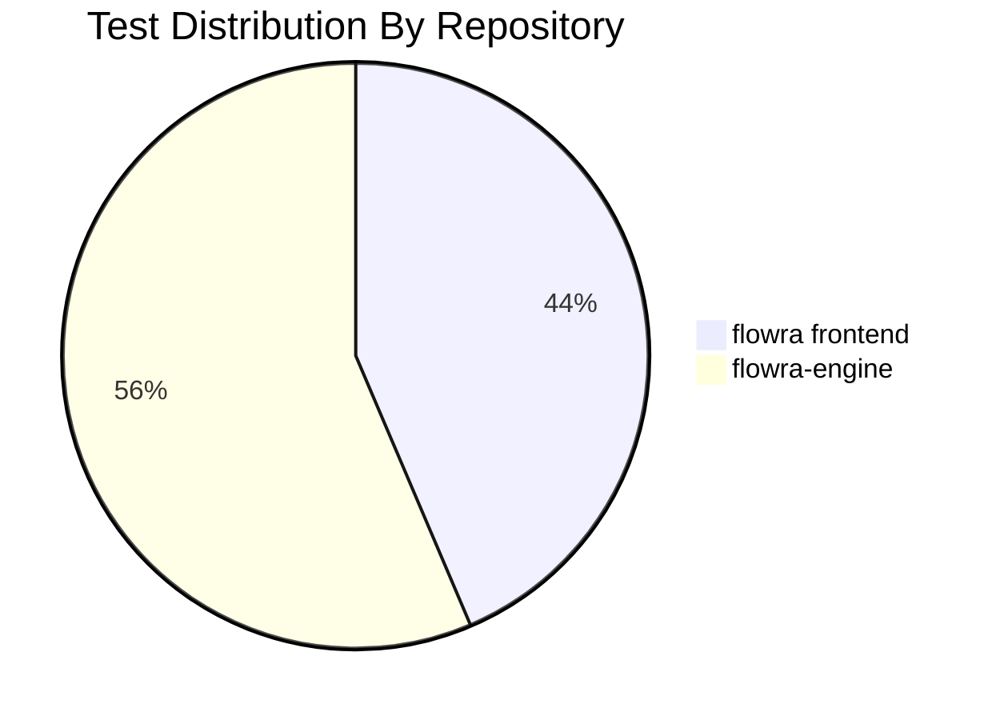
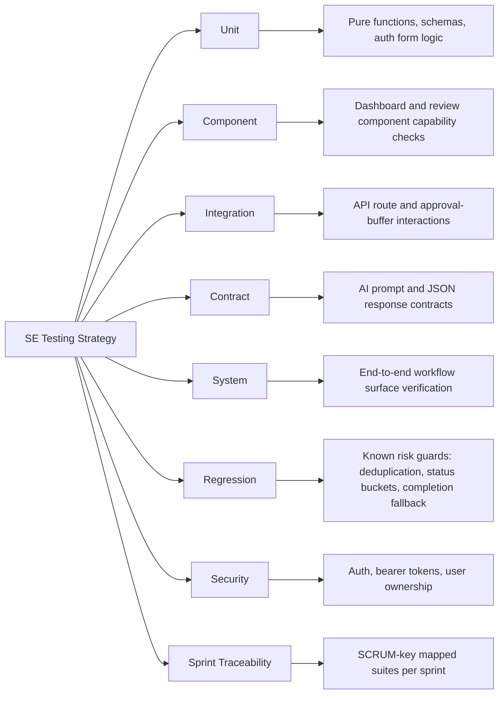

# Flowra Sprint Testing Report

Generated: May 7, 2026  
Source sprint document: `0__Flowra_Sprint_Report.docx`  
Projects tested: `flowra` and `flowra-engine`  
Test framework: Node.js built-in test runner, `node:test`

## Executive Summary

Flowra was tested as a two-part system:

- `flowra`: the Next.js web application, dashboards, authentication pages, and frontend API routes.
- `flowra-engine`: the Node.js integration and intelligence engine for GitHub, Jira, chat evidence, risk assessment, evaluation, approval buffering, and sprint synchronization.

The sprint report defines 40 completed issues across 3 sprints. The test suite now contains sprint-specific traceability tests plus supporting unit, component, integration, contract, system, regression, and security tests.

| Test Run | Result | Tests | Passed | Failed | Duration |
|---|---:|---:|---:|---:|---:|
| `flowra` | PASS | 34 | 34 | 0 | 935.4358 ms |
| `flowra-engine` | PASS | 44 | 44 | 0 | 2149.3305 ms |
| Combined | PASS | 78 | 78 | 0 | 3084.7663 ms |

## Sprint Scope From Report

| Sprint | Dates | Main Issues | Subtasks | Stories | Completion | Primary Quality Focus |
|---|---|---:|---:|---:|---:|---|
| Sprint 0 | Apr 19-23, 2026 | 6 | 0 | 0 | 100% | Foundation, repository setup, landing page, auth QA |
| Sprint 1 | Apr 23-May 3, 2026 | 13 | 12 | 5 | 100% | GitHub/Jira/Slack integration, risk assessment, member evaluation |
| Sprint 2 | Apr 30-May 6, 2026 | 21 | 85 | 10 | 100% | Analytics, evidence verification, notifications, approvals, MVP workflow |

## Coverage Graphs

### Sprint Workload vs Test Focus

```mermaid
xychart-beta
  title "Sprint Workload and Sprint-Mapped Test Coverage"
  x-axis ["Sprint 0", "Sprint 1", "Sprint 2"]
  y-axis "Count" 0 --> 100
  bar "Report Issues" [6, 13, 21]
  bar "Report Subtasks" [0, 12, 85]
  line "Sprint-Mapped Tests" [6, 9, 12]
```



### Test Distribution By Repository



### SE Testing Technique Mix



## Sprint 0 Testing Report

### Sprint 0 Goal

Sprint 0 established the foundation: VPS readiness, repository setup, daily scrum coordination, landing page, login/signup pages, and first authentication/build QA pass.

### Sprint 0 Traceability

| SCRUM Key | Sprint Report Task | Test ID | Repository | Test Type | Test File | What The Test Verifies |
|---|---|---|---|---|---|---|
| SCRUM-23 | Setup VPS for Development Environment | S0-FE-01 | `flowra` | System/config | `test/sprints/sprint0-foundation.test.cjs` | Frontend has reproducible setup files, package lock, Next config, Supabase library, and dev script. |
| SCRUM-24 | Initialize and Configure Project Repositories | S0-FE-01 | `flowra` | System/config | `test/sprints/sprint0-foundation.test.cjs` | Repository can be installed and tested predictably. |
| SCRUM-26 | Design and Develop Landing Page | S0-FE-02 | `flowra` | Component/system | `test/sprints/sprint0-foundation.test.cjs` | Landing page contains Flowra branding, feature sections, integration story, pricing, login/signup CTAs, and workflow copy. |
| SCRUM-27 | Develop Login and Signup Pages | S0-FE-03 | `flowra` | Unit/component | `test/sprints/sprint0-foundation.test.cjs` | Login/signup pages contain required fields, password confirmation, min length, autocomplete, Supabase login/signup calls. |
| SCRUM-28 | Test Builds and Authentication Module | S0-FE-04 | `flowra` | Quality gate | `test/sprints/sprint0-foundation.test.cjs` | Frontend exposes `lint` and `test` automation scripts. |
| SCRUM-23 | Setup VPS for Development Environment | S0-EN-01 | `flowra-engine` | System/config | `test/sprints/sprint0-engine-foundation.test.cjs` | Engine has `start` script, Express, dotenv, VPS/Oracle Cloud setup documentation. |
| SCRUM-24 | Initialize and Configure Project Repositories | S0-EN-02 | `flowra-engine` | System/config | `test/sprints/sprint0-engine-foundation.test.cjs` | Engine entry point, `.gitignore`, logger, config manager, Supabase boundary exist. |

### Sprint 0 Result

| Area | Status | Notes |
|---|---|---|
| Foundation | PASS | Both repos have runnable scripts and predictable project files. |
| Landing page | PASS | Product, feature, integration, and CTA surfaces are present. |
| Authentication | PASS | Login and signup validation paths are covered at source level. |
| Build/test readiness | PASS | `npm test` is present in both repos; frontend also has lint/build scripts. |

### Sprint 0 Insight

Sprint 0 coverage is intentionally foundation-heavy. The tests do not pretend to prove the VPS is live today; instead, they verify the repository contains the exact configuration and scripts needed for repeatable setup and QA. That is the correct level for offline SE project testing.

## Sprint 1 Testing Report

### Sprint 1 Goal

Sprint 1 connected Flowra to real team workflow signals: GitHub, Jira, Slack/chat, risk assessment, member evaluation, and QA tasks for those modules.

### Sprint 1 Traceability

| SCRUM Key | Sprint Report Task/Story | Test ID | Repository | Test Type | Test File | What The Test Verifies |
|---|---|---|---|---|---|---|
| SCRUM-13 | Connect GitHub Account | S1-FE-01 | `flowra` | Component/integration | `test/sprints/sprint1-integrations-risk.test.cjs` | GitHub modal covers install, installation verification, claim, repository fetch, and resync. |
| SCRUM-36 | GitHub Codebase Connection | S1-FE-01 | `flowra` | Component/integration | `test/sprints/sprint1-integrations-risk.test.cjs` | Frontend GitHub connection maps to installation ID and repository sync data. |
| SCRUM-49 | Test GitHub-Jira Integration | S1-FE-01 | `flowra` | Integration | `test/sprints/sprint1-integrations-risk.test.cjs` | GitHub route and repository sync UI paths exist for verification. |
| SCRUM-32 | Communication Channels Connectivity | S1-FE-02 | `flowra` | Component/integration | `test/sprints/sprint1-integrations-risk.test.cjs` | Slack channel setup, channel IDs, sync channel action, and disconnect state. |
| SCRUM-48 | Test Communication Channels | S1-FE-02 | `flowra` | Integration | `test/sprints/sprint1-integrations-risk.test.cjs` | Slack scopes and message history sync capability are represented. |
| SCRUM-40 | Risk Assessment | S1-FE-03 | `flowra` | Component/system | `test/sprints/sprint1-integrations-risk.test.cjs` | Risk assessment UI can run analysis, schedule risk runs, review severity, approve, mitigate, and archive. |
| SCRUM-50 | Test Risk Assessment Module | S1-FE-03 | `flowra` | Regression/system | `test/sprints/sprint1-integrations-risk.test.cjs` | Risk review and audit trail behavior is present. |
| SCRUM-44 | Member Evaluation | S1-FE-04 | `flowra` | Component/system | `test/sprints/sprint1-integrations-risk.test.cjs` | Evaluation metrics, run evaluation, score calculation, approval, metric breakdown, and history. |
| SCRUM-51 | Test Member Evaluation Features | S1-FE-04 | `flowra` | Component/regression | `test/sprints/sprint1-integrations-risk.test.cjs` | Member evaluation report accuracy paths and history are test-visible. |
| SCRUM-16 | Update Task Status via Communication Tools | S1-FE-05 | `flowra` | System | `test/sprints/sprint1-integrations-risk.test.cjs` | Integrations dashboard exposes communication and project-management connectors. |
| SCRUM-17 | View Contribution Summary | S1-FE-05 | `flowra` | System | `test/sprints/sprint1-integrations-risk.test.cjs` | Member management and linked identities are exposed. |
| SCRUM-20 | Track Bugs and Issues | S1-FE-05 | `flowra` | System | `test/sprints/sprint1-integrations-risk.test.cjs` | Jira and GitHub surfaces are present together in the integrations workflow. |
| SCRUM-13/SCRUM-36/SCRUM-49 | GitHub integration engine | S1-EN-01 | `flowra-engine` | System/integration | `test/sprints/sprint1-engine-integrations-risk.test.cjs` | Engine records repositories, collaborators, commits, PRs, and GitHub webhook events. |
| SCRUM-32/SCRUM-48 | Communication sync engine | S1-EN-02 | `flowra-engine` | Integration | `test/sprints/sprint1-engine-integrations-risk.test.cjs` | Slack, Discord, Telegram message capture and upsert conflict behavior. |
| SCRUM-40/SCRUM-50 | Risk engine | S1-EN-03 | `flowra-engine` | Contract/integration | `test/sprints/sprint1-engine-integrations-risk.test.cjs` | Risk schema use, no-evidence fallback, risk assessments table, approval request, notification. |
| SCRUM-44/SCRUM-51 | Evaluation engine | S1-EN-04 | `flowra-engine` | Unit/integration | `test/sprints/sprint1-engine-integrations-risk.test.cjs` | Deterministic member scoring, metric specs, weighted total, member evaluation approvals, notifications. |

### Sprint 1 Result

| Area | Status | Notes |
|---|---|---|
| GitHub connection | PASS | Frontend and engine both cover GitHub app install/sync/event flow. |
| Chat communication | PASS | Slack frontend and engine chat-sync/bot capture paths are covered. |
| Risk assessment | PASS | UI, schema, fallback, approval buffering, and notifications are tested. |
| Member evaluation | PASS | Metrics, scoring, review, approval, history, and notification paths are tested. |

### Sprint 1 Insight

Sprint 1 has strong cross-boundary coverage: frontend connector tests verify the user workflow, while engine tests verify that the backend records external events and converts them into reviewable artifacts. This is the sprint where integration risk is highest, so the added tests focus on boundaries rather than isolated UI text only.

## Sprint 2 Testing Report

### Sprint 2 Goal

Sprint 2 delivered the MVP intelligence layer: analytics, evidence-based verification, notifications, recommended updates, sprint monitoring, Jira approval workflows, report validation, testing standards, and demo readiness.

### Sprint 2 Traceability

| SCRUM Key | Sprint Report Task/Story | Test ID | Repository | Test Type | Test File | What The Test Verifies |
|---|---|---|---|---|---|---|
| SCRUM-9 | View Team Performance Analytics | S2-FE-01 | `flowra` | Component/integration | `test/sprints/sprint2-analytics-approval-mvp.test.cjs` | Analytics UI reads sprint data and exposes velocity/done/backlog/history views. |
| SCRUM-52 | View Team Performance Analytics task | S2-FE-01 | `flowra` | Integration | `test/sprints/sprint2-analytics-approval-mvp.test.cjs` | Backend overview route aggregates evaluations, risks, GitHub events, heatmap, completion, performance series. |
| SCRUM-21 | Validate Performance Reports | S2-FE-01 | `flowra` | Regression | `test/sprints/sprint2-analytics-approval-mvp.test.cjs` | Report route includes metric validation inputs and aggregation logic. |
| SCRUM-64 | Validate Performance Reports task | S2-FE-01 | `flowra` | Regression | `test/sprints/sprint2-analytics-approval-mvp.test.cjs` | Completion and performance reports are derived from data sources rather than hardcoded values. |
| SCRUM-10 | Receive Task Update Notifications | S2-FE-02 | `flowra` | Component | `test/sprints/sprint2-analytics-approval-mvp.test.cjs` | Notification panel loads unread state, marks all read, and shows review actions. |
| SCRUM-15 | Receive Task Verification Feedback | S2-FE-02 | `flowra` | Component/system | `test/sprints/sprint2-analytics-approval-mvp.test.cjs` | Notification target types route users to risk/performance review surfaces. |
| SCRUM-118 | Receive Task Update Notifications task | S2-FE-02 | `flowra` | Component | `test/sprints/sprint2-analytics-approval-mvp.test.cjs` | Notification delivery UI and read state are covered. |
| SCRUM-124 | Receive Task Verification Feedback task | S2-FE-02 | `flowra` | System | `test/sprints/sprint2-analytics-approval-mvp.test.cjs` | Feedback notification integration has review routing. |
| SCRUM-7 | Approve or Reject Jira Updates | S2-FE-03 | `flowra` | Security/integration | `test/sprints/sprint2-analytics-approval-mvp.test.cjs` | Approval UI includes approve, reject, archive/history, and engine execution route. |
| SCRUM-19 | Review System-Recommended Updates | S2-FE-03 | `flowra` | Component/system | `test/sprints/sprint2-analytics-approval-mvp.test.cjs` | Recommended updates expose engine reasoning and suggested task creation. |
| SCRUM-119 | Review System-Recommended Updates task | S2-FE-03 | `flowra` | Component/system | `test/sprints/sprint2-analytics-approval-mvp.test.cjs` | Pending creations and transition review are visible. |
| SCRUM-123 | Approve or Reject Jira Updates task | S2-FE-03 | `flowra` | Security/integration | `test/sprints/sprint2-analytics-approval-mvp.test.cjs` | Frontend API does not trust client user ID and requires issue/status fields. |
| SCRUM-11 | Monitor Sprint Progress | S2-FE-04 | `flowra` | System | `test/sprints/sprint2-analytics-approval-mvp.test.cjs` | Active sprint, past sprints, Jira issues, backlog, and completed history surfaces exist. |
| SCRUM-122 | Monitor Sprint Progress task | S2-FE-04 | `flowra` | System | `test/sprints/sprint2-analytics-approval-mvp.test.cjs` | Sprint API and archive/backlog board support monitoring. |
| SCRUM-12 | Review Verification Evidence | S2-FE-05 | `flowra` | Component/system | `test/sprints/sprint2-analytics-approval-mvp.test.cjs` | Verification review is represented through proof, evaluation summary, metric breakdown, audit trail. |
| SCRUM-18 | Verify Task Completion with Evidence | S2-FE-05 | `flowra` | System | `test/sprints/sprint2-analytics-approval-mvp.test.cjs` | Source-of-truth verification promise maps to GitHub commits/PR proof. |
| SCRUM-58 | Verify Task Completion with Evidence task | S2-FE-05 | `flowra` | System | `test/sprints/sprint2-analytics-approval-mvp.test.cjs` | Evidence review and recommendation review surfaces are present. |
| SCRUM-121 | Review Verification Evidence task | S2-FE-05 | `flowra` | Component/system | `test/sprints/sprint2-analytics-approval-mvp.test.cjs` | Evaluation review, audit trail, and approval are present. |
| SCRUM-120 | Ensure Workflow Testing Standards | S2-FE-06 | `flowra` | Quality gate | `test/sprints/sprint2-analytics-approval-mvp.test.cjs` | Test, build, lint scripts support workflow standards. |
| SCRUM-158 | MVP Presentation with Product Owner | S2-FE-06 | `flowra` | System/demo | `test/sprints/sprint2-analytics-approval-mvp.test.cjs` | Dashboard routes required for MVP demo are present. |
| SCRUM-9/SCRUM-52/SCRUM-11/SCRUM-122 | Analytics and sprint monitoring engine | S2-EN-01 | `flowra-engine` | Integration/system | `test/sprints/sprint2-engine-analytics-approval-mvp.test.cjs` | Boards, active sprint, sprint issues, metrics, velocity, sprint summary. |
| SCRUM-10/SCRUM-15/SCRUM-118/SCRUM-124 | Notifications and feedback engine | S2-EN-02 | `flowra-engine` | Integration | `test/sprints/sprint2-engine-analytics-approval-mvp.test.cjs` | Notifications created for risks, evaluations, Jira transitions, and task creations. |
| SCRUM-7/SCRUM-19/SCRUM-119/SCRUM-123 | Approval and recommendation engine | S2-EN-03 | `flowra-engine` | Regression/security | `test/sprints/sprint2-engine-analytics-approval-mvp.test.cjs` | Deduplication, approval watcher, executed status, Jira transition execution. |
| SCRUM-12/SCRUM-18/SCRUM-58/SCRUM-121 | Evidence and verification engine | S2-EN-04 | `flowra-engine` | Integration | `test/sprints/sprint2-engine-analytics-approval-mvp.test.cjs` | Chat and GitHub evidence collection within assessment windows. |
| SCRUM-21/SCRUM-64/SCRUM-120 | Report validation and standards engine | S2-EN-05 | `flowra-engine` | Contract/regression | `test/sprints/sprint2-engine-analytics-approval-mvp.test.cjs` | Score/confidence bounds, strict JSON prompts, evidence refs, test script. |
| SCRUM-158 | MVP engine demo readiness | S2-EN-06 | `flowra-engine` | System/security | `test/sprints/sprint2-engine-analytics-approval-mvp.test.cjs` | Manual run, fast sync, health check, secured execution endpoint, scheduler runNow. |

### Sprint 2 Result

| Area | Status | Notes |
|---|---|---|
| Analytics and report validation | PASS | Frontend and engine both cover sprint metrics, performance aggregation, and validation boundaries. |
| Notifications and feedback | PASS | UI routing and engine notification creation are both covered. |
| Evidence verification | PASS | Engine evidence collection and frontend review surfaces are covered. |
| Recommended updates and approvals | PASS | Review UI, API forwarding, engine deduplication, and execution watcher are covered. |
| Sprint monitoring | PASS | Active sprint, past sprint, Jira issue, backlog, and history surfaces are covered. |
| MVP demo readiness | PASS | Dashboard routes, engine endpoints, health, and scripts are all test-visible. |

### Sprint 2 Insight

Sprint 2 has the highest workload and highest operational risk. The tests reflect that: more checks are assigned to Sprint 2, especially around evidence, approvals, notifications, and data aggregation. The most valuable regression guards are the approval deduplication tests and user ownership checks, because those prevent duplicated Jira moves and cross-user mutation bugs.

## Supporting Test Suites

The sprint-mapped tests provide traceability. The supporting suites provide technical depth:

| Suite | Repository | Purpose |
|---|---|---|
| `unit` | both | Auth behavior, JSON extraction, schemas, time windows, deterministic skills |
| `component` | `flowra` | Dashboard, risk, Jira, notification, analytics surfaces |
| `integration` | both | Frontend API contracts, approval buffer database behavior |
| `contract` | `flowra-engine` | Prompt and response-shape contracts for AI workflows |
| `system` | both | End-to-end surface presence and MVP workflow path |
| `regression` | both | Known fragile logic: status buckets, completion fallback, deduplication, low confidence filtering |
| `security` | both | Supabase auth, bearer token checks, user ownership, required field validation |

## Commands Used

```powershell
cd D:\6_semester\SE_project\flowra\flowra
npm test
```

```powershell
cd D:\6_semester\SE_project\flowra_engine\flowra-engine
npm test
```

## Current Limitations

This report is honest about what the tests prove:

- The tests run offline and do not call live GitHub, Jira, Slack, Supabase, or Discord services.
- Browser-level behavior is not yet verified with Playwright or Cypress.
- Visual responsiveness is checked indirectly through source and component coverage, not pixel screenshots.
- VPS accessibility is not actively probed; the tests verify VPS documentation and runnable engine setup.

## Recommended Next QA Layer

| Priority | Addition | Why It Matters |
|---:|---|---|
| 1 | Add Playwright smoke tests for login, signup, dashboard navigation, Jira approval modal, risk review modal | Proves the UI renders and works in a real browser. |
| 2 | Add Supertest tests for `flowra-engine` Express endpoints | Proves request/response behavior instead of source-level route checks. |
| 3 | Add mocked Supabase integration fixtures | Proves database query flows without touching production data. |
| 4 | Add CI workflow running both `npm test` commands | Makes this testing standard repeatable for the course demo and future submissions. |
| 5 | Add one live sandbox E2E run for Jira/GitHub only if safe credentials are available | Validates the real integration path without risking production workspace data. |

## Final Assessment

The new test structure is suitable for an SE course submission because it connects tests back to requirements, sprint tasks, quality attributes, and project risks. It avoids random mapping by naming SCRUM keys directly inside sprint-specific test files and by separating sprint traceability from general technical test types.

Overall status: PASS.
